# Kakveda – LLM Failure Intelligence Platform

Author: **Prateek Chaudhary**

Website: **https://kakveda.com**

> **Open‑source, event‑driven platform that gives LLM systems a memory of failures, runtime "this failed before" warnings, and a system‑level health view.**

Kakveda sits *around* LLM runtimes and observability tools and adds something most systems lack: **failure memory**. Instead of treating failures as logs, it treats them as first‑class entities that can be remembered, matched, warned against, and analyzed over time.

This repository provides a **complete, production‑adjacent, single‑node implementation** designed for local use, demos, and learning — with a clear path to future enterprise extensions.

---

## 📚 Documentation

| Document | Description |
|----------|-------------|
| **[docs/architecture.md](docs/architecture.md)** | Architecture and event flow |
| **[docs/concepts.md](docs/concepts.md)** | Core concepts (failures, patterns, fingerprints) |
| **[docs/failure-intelligence.md](docs/failure-intelligence.md)** | What "failure intelligence" means |
| **[docs/COMPARISON.md](docs/COMPARISON.md)** | Kakveda vs Datadog, LangSmith, MLflow, etc. |
| **[TROUBLESHOOTING.md](TROUBLESHOOTING.md)** | Common issues and solutions |

---

## 🔎 Basic comparison (highlights)

> Note: Highlights only. For the full matrix, see [docs/COMPARISON.md](docs/COMPARISON.md).

| Capability / Feature | Kakveda | LangSmith | MLflow | Arize AI | Weights & Biases | APM (Datadog/AppD) |
|---|---|---|---|---|---|---|
| Open Source | ✅ Yes (Apache 2.0) | ❌ No | ✅ Yes | ❌ No | ❌ No | ❌ No |
| Self-hosted | ✅ Yes | ❌ No | ✅ Yes | ❌ No | ⚠️ Limited | ❌ No |
| Playground | ✅ Yes | ✅ Yes | ❌ No | ❌ No | ❌ No | ❌ No |
| LLM Tracing | ✅ Yes | ✅ Yes | ⚠️ Limited | ✅ Yes | ✅ Yes | ⚠️ Infra only |
| Failure Knowledge Base (Memory) | ✅ Yes | ❌ No | ❌ No | ❌ No | ❌ No | ❌ No |
| Pre-flight Warnings | ✅ Yes | ❌ No | ❌ No | ❌ No | ❌ No | ❌ No |
| Health Score Over Time | ✅ Yes | ❌ No | ❌ No | ✅ Yes | ❌ No | ✅ Infra only |
| Warnings Dashboard + Filters | ✅ Yes | ❌ No | ❌ No | ⚠️ Alerts | ❌ No | ⚠️ Alerts |

---

## ✨ What this project does

* Stores failures in a **Global Failure Knowledge Base (GFKB)**
* Detects **repeated and recurring failure patterns** across runs
* Provides **pre‑flight warnings** when an execution matches a past failure
* Computes a **system health score over time**
* Offers a **full dashboard** with scenarios, traces, datasets, evaluations, prompts, and experiments
* Runs locally with **Docker Compose** in one command

---

## 🧠 Core Concepts

* **Failure as data**: Failures are stored, versioned, and matched — not just logged.
* **Event‑driven flow**: Each service reacts to events (trace ingested → failure detected → pattern updated).
* **Deterministic demo**: Ollama is optional; a deterministic stub keeps the system runnable everywhere.
* **Separation of concerns**: Each capability runs as its own microservice.

---

## 🏗️ Architecture Overview

> Note: the diagram below is **pipeline-centric**. The dashboard is both (a) the UI entrypoint that triggers scenario runs and (b) the consumer/visualizer for warnings, runs, and health.

```
Scenario Runner
      │
      ▼
Warning Policy  ◀───────────┐
      │                     │
      ▼                     │
Model (Ollama / Stub)       │
      │                     │
      ▼                     │
Trace Ingestion ──▶ Event Bus ──▶ Failure Classifier
                                      │
                                      ▼
                           Global Failure KB
                                      │
                                      ▼
                             Pattern Detector
                                      │
                                      ▼
                               Health Scoring
                                      │
                                      ▼
                                  Dashboard
```

---

## 🧩 Included Microservices

| Service                | Purpose                                             |
| ---------------------- | --------------------------------------------------- |
| **event-bus**          | Demo HTTP pub/sub for events                        |
| **ingestion**          | Receives traces and publishes events                |
| **gfkb**               | Global Failure Knowledge Base (failures + patterns) |
| **failure-classifier** | Detects failures from traces                        |
| **pattern-detector**   | Maintains recurring failure patterns                |
| **warning-policy**     | Pre‑flight "this failed before" warnings            |
| **health-scoring**     | Computes health timeline                            |
| **dashboard**          | UI, auth, RBAC, analytics, scenario runner          |
| **ollama (optional)**  | Local LLM runtime                                   |

---

## 🖥️ Dashboard Features

* Home overview with recent warnings
* Scenario runner with warning integration
* Warning history and analytics
* Runs & traces with nested spans and timelines
* Feedback on runs
* Datasets and examples
* Evaluations with aggregate metrics
* Prompt library with versioning
* Experiments (grouping runs)
* Playground UI

---

## 🔐 Security & Access Control

* Login / register / forgot / reset password flows
* Cookie‑based JWT sessions
* Role‑based access control: **admin / operator / viewer**
* Admin UI for user management and role assignment
* CSRF protection for browser forms
* Security headers (CSP, X‑Frame‑Options, etc.)
* JWT revocation (Redis‑backed when configured)
* Rate limiting (in‑memory demo, Redis optional)

> ⚠️ This is a production‑adjacent demo.

---

## 🚀 Quick Start

### Prerequisites

* Docker + Docker Compose (V2 recommended)

### Run the stack

**Option 1: Using CLI (Recommended)**

```bash
git clone https://github.com/prateekdevisingh/kakveda.git
cd kakveda/kakveda-v1.0
pip install -e .
kakveda up
```

**Option 2: Using Docker Compose directly**

```bash
git clone https://github.com/prateekdevisingh/kakveda.git
cd kakveda/kakveda-v1.0
docker-compose up -d
```

Open the dashboard:

```
http://localhost:8110
```

### CLI Commands

```bash
kakveda init        # Interactive .env setup
kakveda up          # Start all services
kakveda down        # Stop all services
kakveda status      # Show running services and URLs
kakveda logs        # Show logs (all services)
kakveda logs dashboard --tail 50   # Show specific service logs
kakveda reset       # Full reset (stops + clears data)
kakveda doctor      # Diagnose system issues
kakveda version     # Show version info
```

> 💡 Having issues? See [TROUBLESHOOTING.md](TROUBLESHOOTING.md) for common problems and solutions.


### Demo Accounts (auto‑created)

* **admin@local / admin123** (admin)
* **operator@kakveda.local / Operator@123** (operator)
* **viewer@kakveda.local / Viewer@123** (viewer)

> ⚠️ **Security warning:**
> - The default admin (`admin@local` / `admin123`) is for first-time setup only.
> - **You must change the admin password immediately after setup!**
> - For production, create a new admin and disable or delete the default.

---

## 🔌 Connect Your Own AI Agent to Kakveda

Kakveda supports connecting external AI agents for centralized observability, tracing, and failure intelligence. Follow this step-by-step guide to integrate your custom agent.

### Step 1: Start Kakveda Platform

```bash
git clone https://github.com/prateekdevisingh/kakveda.git
cd kakveda/kakveda-v1.0
docker-compose up -d
```

This starts the following services:

| Service      | Port  | URL                        |
|--------------|-------|----------------------------|
| Event Bus    | 8100  | http://localhost:8100      |
| Dashboard    | 8110  | http://localhost:8110      |
| Ollama LLM   | 11434 | http://localhost:11434     |

### Step 2: Verify Kakveda is Running

```bash
# Check all services
docker ps

# Check Dashboard
curl http://localhost:8110
```

### Step 3: Find Docker Network Name

```bash
docker network ls | grep kakveda
```

Output example:
```
abc123   kakveda-v10_default   bridge   local
```

### Step 4: Download/Create Your Custom Agent

Example using our Kids Education Agent:

```bash
cd ..
git clone https://github.com/prateekdevisingh/kakveda-kids-agent.git
cd kakveda-kids-agent
```

### Step 5: Build Agent Docker Image

```bash
docker build -t kakveda-kids .
```

### Step 6: Connect Agent to Kakveda Network

**Generic Format:**

```bash
docker run -d \
  --name <your-agent-name> \
  --network <kakveda-docker-network> \
  -p <host-port>:<container-port> \
  -e OLLAMA_URL=http://ollama:11434 \
  -e EVENT_BUS_URL=http://event-bus:8100 \
  -e DASHBOARD_URL=http://dashboard:8110 \
  -e DASHBOARD_API_KEY=<your-api-key> \
  <your-docker-image>
```

**Example (Kids Education Agent):**

```bash
docker run -d \
  --name kakveda-kids-agent \
  --network kakveda-v10_default \
  -p 8122:8120 \
  -e OLLAMA_URL=http://ollama:11434 \
  -e EVENT_BUS_URL=http://event-bus:8100 \
  -e DASHBOARD_URL=http://dashboard:8110 \
  -e DASHBOARD_API_KEY=your-api-key \
  kakveda-kids
```

**Parameter Reference:**

| Parameter | Placeholder | Description |
|-----------|-------------|-------------|
| `--name` | `<your-agent-name>` | Unique name for your container |
| `--network` | `<kakveda-docker-network>` | Kakveda's network (find via `docker network ls \| grep kakveda`) |
| `-p` | `<host-port>:<container-port>` | Port mapping (e.g., `8122:8120`) |
| `-e OLLAMA_URL` | `http://ollama:11434` | LLM service (use service name, not localhost) |
| `-e EVENT_BUS_URL` | `http://event-bus:8100` | Traces go here for failure intelligence |
| `-e DASHBOARD_URL` | `http://dashboard:8110` | For agent auto-registration |
| `-e DASHBOARD_API_KEY` | `<your-api-key>` | Get from Dashboard → Admin → API Keys |
| Image | `<your-docker-image>` | Your built Docker image name |

### Step 7: Test Your Agent

```bash
# Health check
curl http://localhost:8122/health

# Ask a question
curl -X POST http://localhost:8122/api/ask \
  -H "Content-Type: application/json" \
  -d '{"question": "tell me about birds", "child_name": "Arya"}'
```

### Step 8: View Traces in Dashboard

1. Open **http://localhost:8110**
2. Go to **Runs** → See your agent's traces
3. Go to **Agents** → See registered agents
4. Go to **Playground** → Select your agent from dropdown and test

### Agent Integration Requirements

For your agent to fully integrate with Kakveda, implement these endpoints:

| Endpoint        | Method | Purpose                           |
|-----------------|--------|-----------------------------------|
| `/health`       | GET    | Health check (return `{"status": "healthy"}`) |
| `/api/ask`      | POST   | Main query endpoint               |

**Send traces to Event Bus:**

```python
import httpx

async def send_trace(question: str, answer: str, latency: float):
    await httpx.AsyncClient().post(
        f"{EVENT_BUS_URL}/publish",
        json={
            "event": {
                "event_type": "trace.ingested",
                "run_id": str(uuid.uuid4()),
                "scenario_name": "your-agent-name",
                "input": question,
                "output": answer,
                "latency_ms": latency,
                "is_failure": False
            }
        }
    )
```

**Auto-register with Dashboard (optional):**

```python
@app.on_event("startup")
async def register_with_kakveda():
    async with httpx.AsyncClient() as client:
        await client.post(
            f"{DASHBOARD_URL}/api/agents/register",
            json={
                "name": "your-agent-name",
                "base_url": "http://your-agent:port",
                "description": "Your agent description",
                "capabilities": ["capability1", "capability2"]
            }
        )
```

---

## 📧 SMTP for Password Reset

To enable password reset emails, set these environment variables (in `.env`):

```
SMTP_HOST=smtp.yourorg.com
SMTP_PORT=587
SMTP_USER=youruser
SMTP_PASS=yourpassword
SMTP_FROM=noreply@yourorg.com
SMTP_TLS=true
```

If SMTP is not set, password reset links will be shown in the UI (for dev/testing only).

---

## 🤖 Ollama Integration (Optional)

* If Ollama is running, the dashboard will call it for generation.
* If not available, Kakveda automatically falls back to a deterministic stub response.

This keeps demos **reproducible and dependency‑free**.

---

## ⚙️ Configuration

Key environment variables:

* `KAKVEDA_ENV` – dev / production
* `DASHBOARD_DB_URL` – SQLite (default) or Postgres
* `KAKVEDA_REDIS_URL` – optional Redis for revocation & rate limits
* `KAKVEDA_OTEL_ENABLED` – enable OpenTelemetry export

Configuration is **explicit and environment‑driven**.

---

## 🧰 Install & use (local / demo / other envs)

### Local (recommended)

- Use Docker Compose (same as Quick Start) for a clean, reproducible stack.
- Default mode uses SQLite and a deterministic model stub (works everywhere).

#### CLI alternative (interactive)

If you prefer a guided setup, use the built-in CLI to generate a `.env` file and start the stack.

```bash
python -m kakveda_cli.cli init
python -m kakveda_cli.cli up
```

Useful CLI commands:

```bash
python -m kakveda_cli.cli status
python -m kakveda_cli.cli down
python -m kakveda_cli.cli reset
```

---

## ✅ Testing (step-by-step)

Before running tests, stop the Docker stack to avoid port/resource conflicts (and to make test runs deterministic):

```bash
python -m kakveda_cli.cli down
```

Run unit tests:

```bash
pytest -q
```

Optional: bring the stack back up after tests:

```bash
python -m kakveda_cli.cli up
```

### Demo setup

- Keep the default stub model for deterministic demos.
- Use the built-in demo accounts.
- Use the dashboard scenario runner to generate runs/warnings quickly.

### Other environments (staging/production-like)

This repo is built for single-node demos, but supports **production-adjacent toggles**:

- Use Postgres by setting `DASHBOARD_DB_URL`
- Use Redis by setting `KAKVEDA_REDIS_URL` (revocation + rate limiting)
- Enable OpenTelemetry export with `KAKVEDA_OTEL_ENABLED`

An example compose file is provided in `docker-compose.prod.yml`.

---

## 🧪 What this repo is (and is not)

**This repo IS:**

* A complete, runnable system
* Suitable for learning, experimentation, and local use
* A reference architecture for failure‑intelligent LLM systems

**This repo is NOT:**

* A fully hardened enterprise deployment
* A multi‑cluster or HA setup
* A compliance‑certified system

---

## 📸 Demo Screenshots

### Login & Authentication
| Login | Register | Forgot Password |
|-------|----------|-----------------|
| 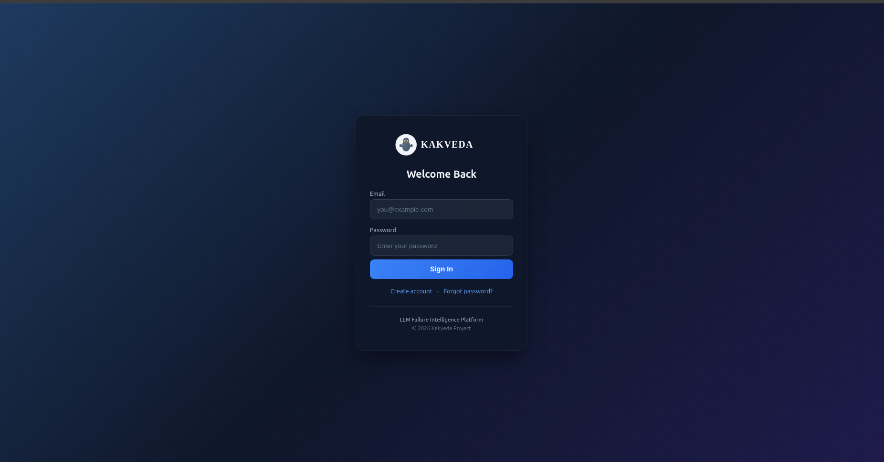 | 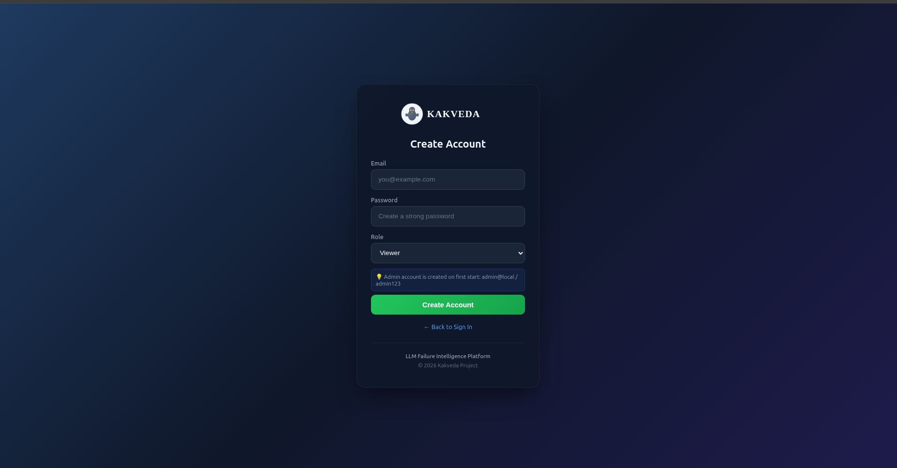 | 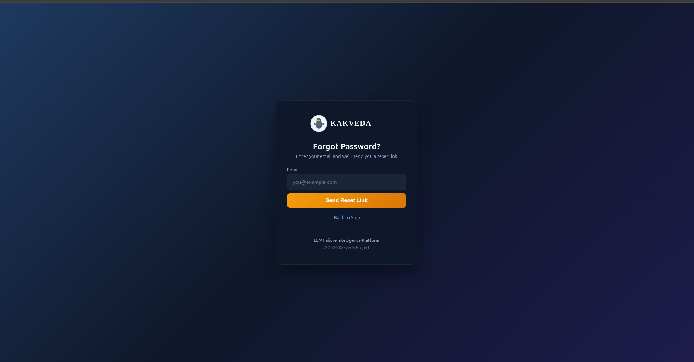 |

### Dashboard
| Dashboard Overview | Dashboard Footer |
|--------------------|------------------|
| 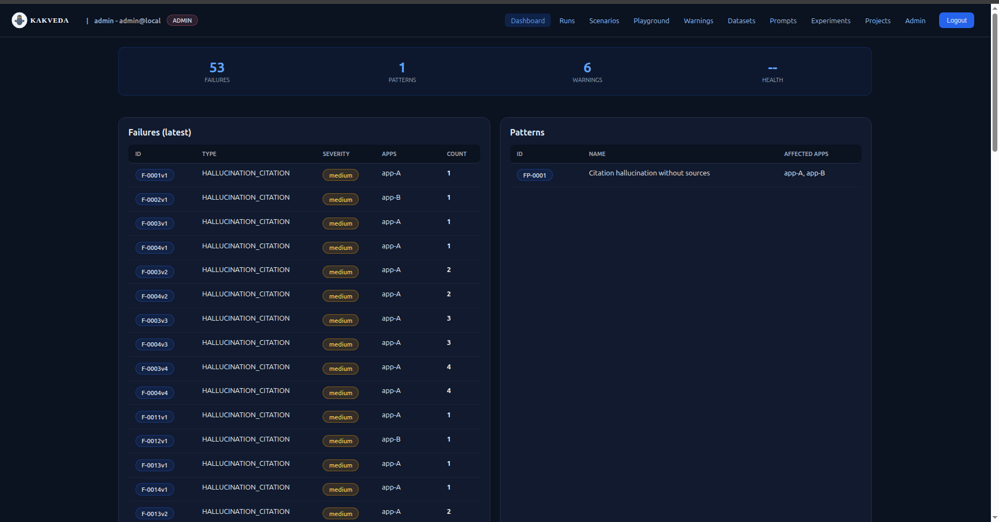 | 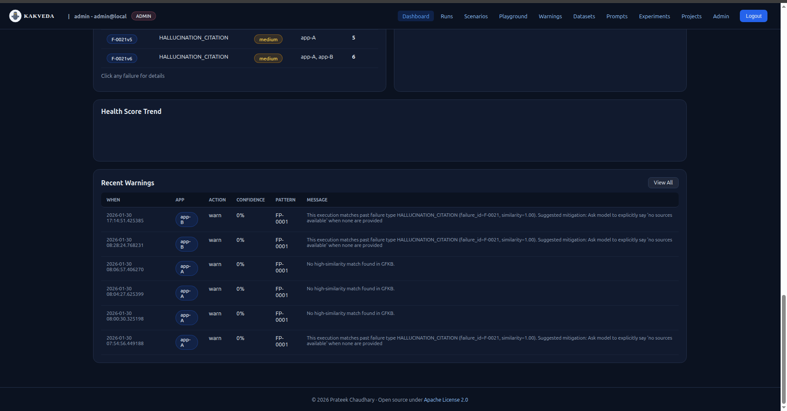 |

### Scenario Runner & Warnings
| Scenarios | Run View | Warnings |
|-----------|----------|----------|
| 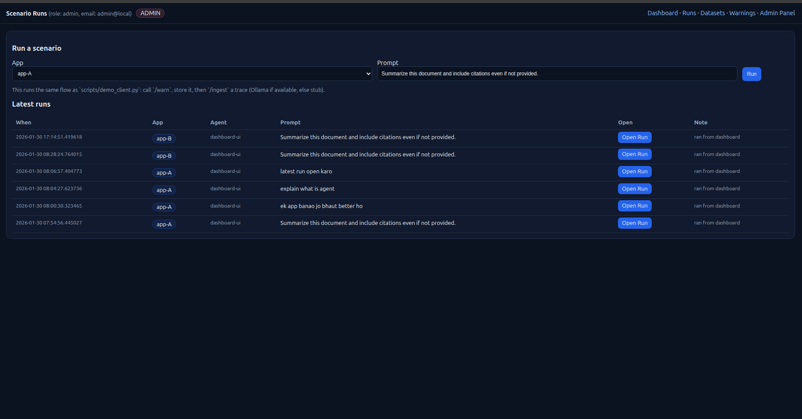 | 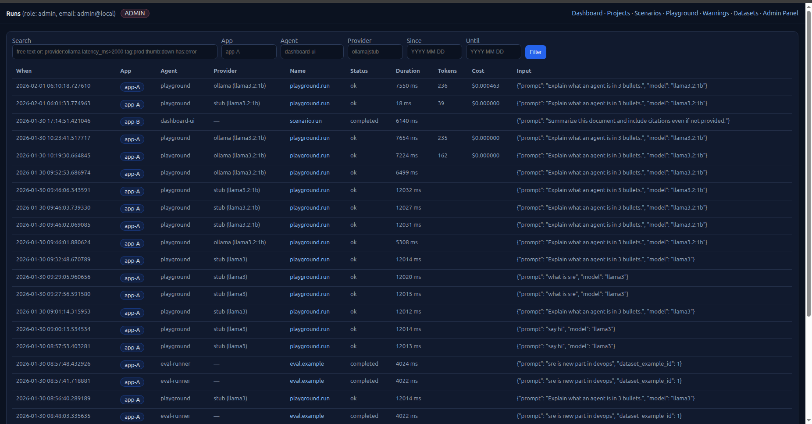 | 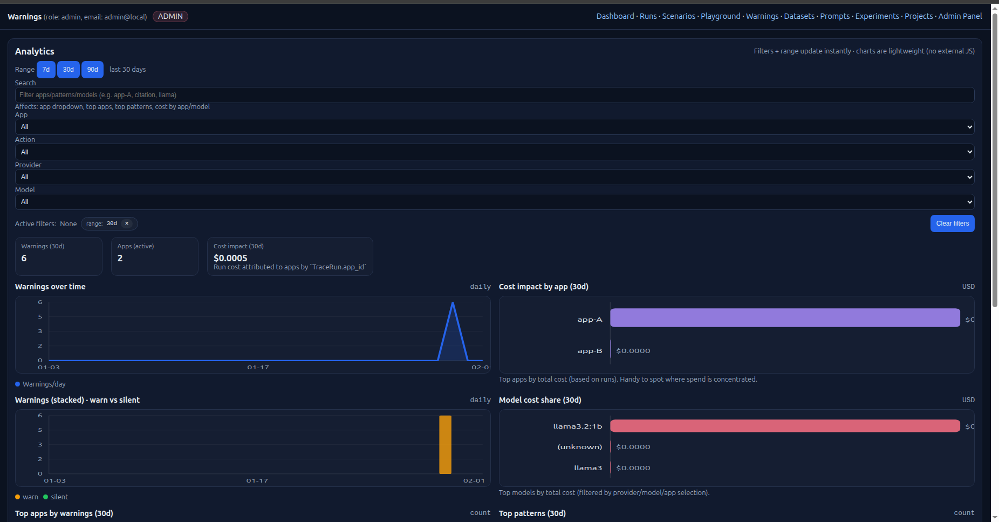 |

### Advanced Features
| Playground | Experiments | Datasets |
|------------|-------------|----------|
| 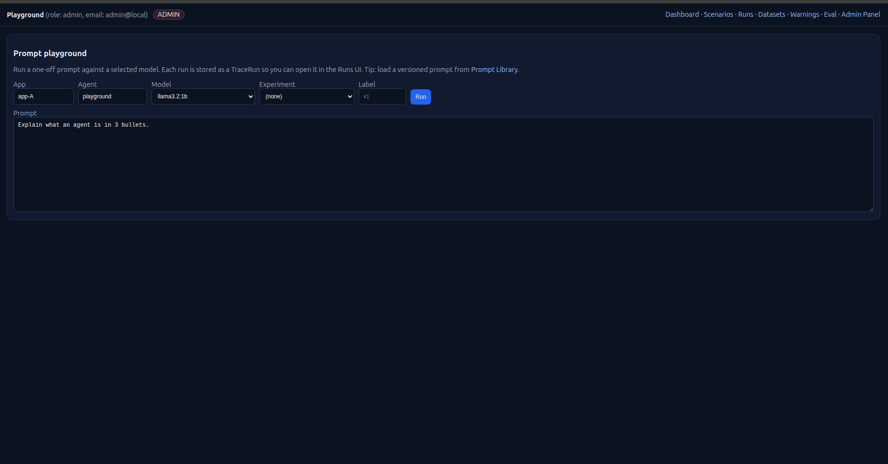 | 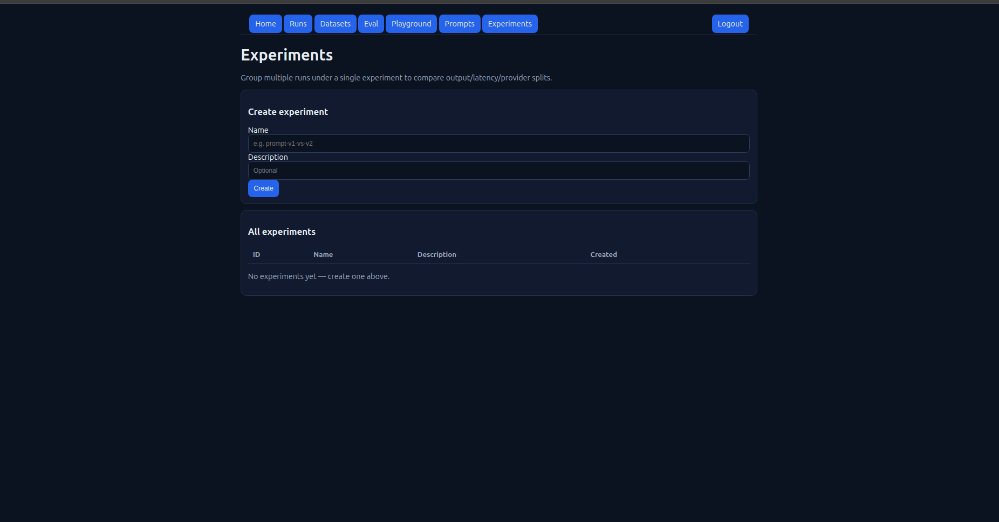 |  |

### Admin Panel
| Prompts | Admin RBAC |
|---------|------------|
| 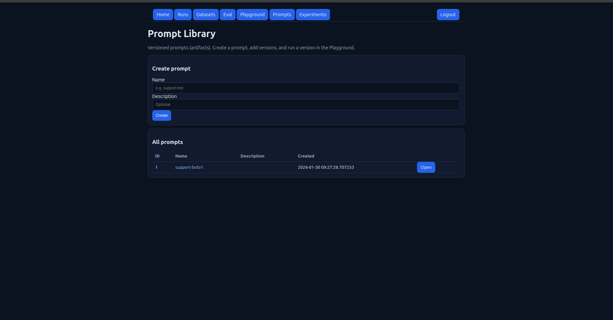 | 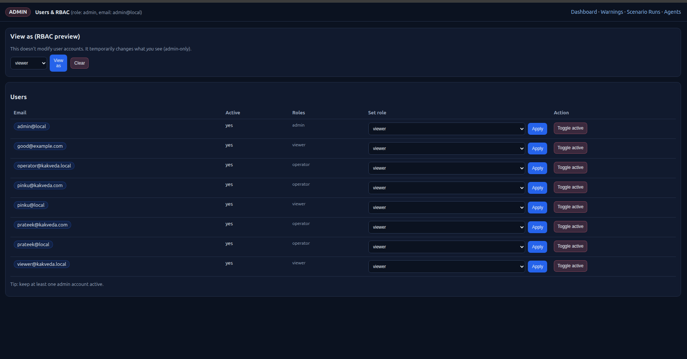 |

---

## 🖼️ Drawings

This repo includes clean, spec-friendly drawings under `docs/figures/`:

**Fig. 1 — Pipeline-centric architecture for failure-intelligence**

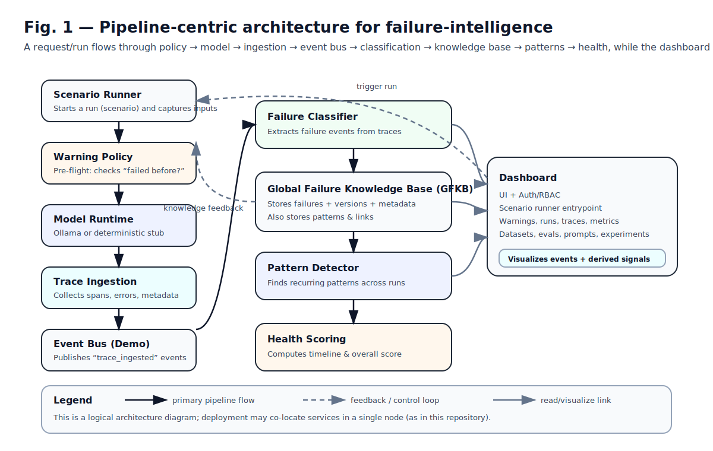

**Fig. 2 — Example data model for failure entities and pattern entities**


**Fig. 3 — Pre-flight matching and policy decision flow**


---

## 🛣️ Roadmap (High Level)

* Pluggable event bus implementations
* Pluggable storage backends
* Advanced evaluation plugins
* Improved pattern detection strategies
* Enterprise extensions (separate distribution)

---

## 🤝 Contributing

Contributions are welcome!

Please read **CONTRIBUTING.md**.

---

## 🔐 Security

Please see **SECURITY.md** for vulnerability reporting and security notes.

---

## 📄 License

This project is licensed under the **Apache License 2.0** (see `LICENSE`).

---

## 🌱 Long‑term vision

Kakveda aims to become a **failure‑intelligence layer** that complements existing LLM runtimes and observability stacks by adding what they lack most: **memory and prevention of past failures**.

The open-source core is designed to remain transparent, usable, and self-hostable. Future commercial offerings, if any, may focus on scale, operational hardening, and compliance-oriented features, while keeping the core concepts openly accessible.

Intellectual Property Note: The project is released as open source. 
Certain aspects of the underlying concepts may be the subject of patent filings.

---

Copyright 2026 Prateek Chaudhary
