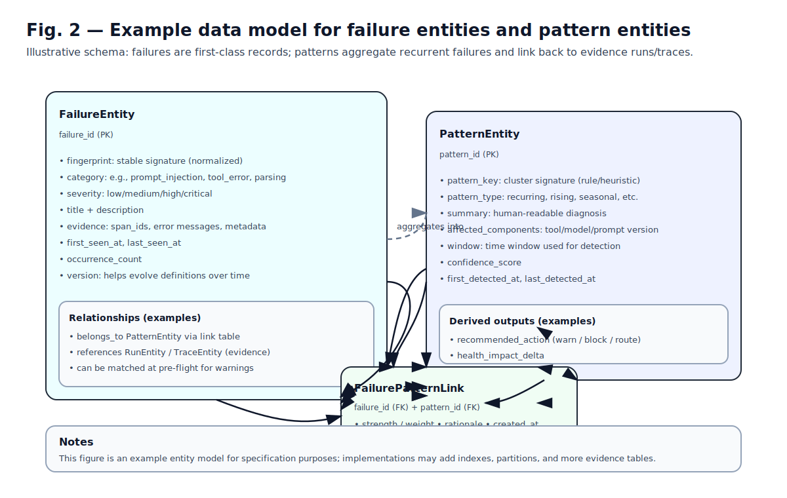
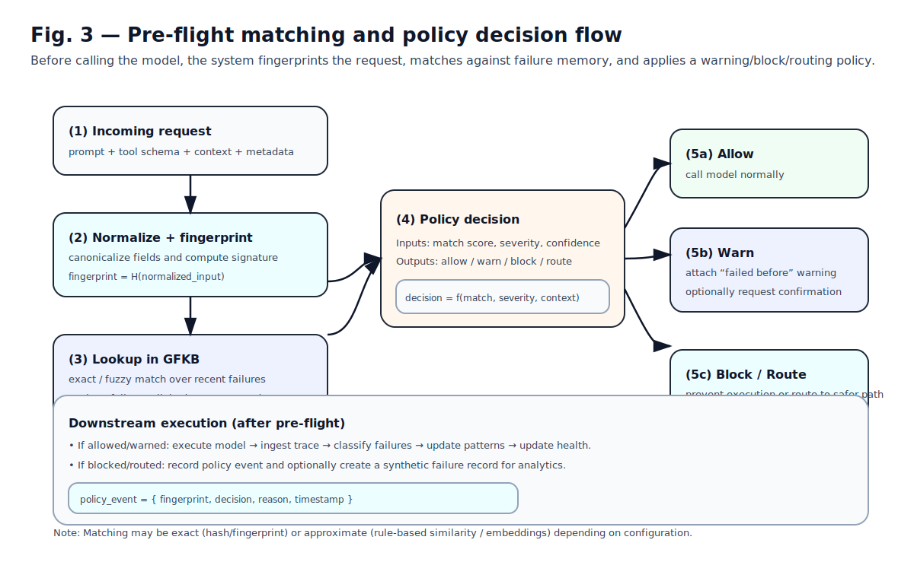

# Concepts

Kakveda is built around a few core ideas.

## Failure as data

Instead of treating failures as logs, Kakveda stores failures as first-class entities that can be:
- remembered
- matched
- warned against
- aggregated into patterns

## Fingerprint

A **fingerprint** is a stable signature derived from normalized request inputs (and optionally model/tool metadata).
It’s used for matching a new request/run against known failures.

## Global Failure Knowledge Base (GFKB)

The GFKB stores:
- Failure entities (individual failures with evidence)
- Pattern entities (recurring clusters of failures)

See the example entity model:

## Pattern

A pattern is an aggregation over failures. It typically has:
- a pattern key / signature
- confidence
- affected components
- recommended action (warn/block/route)

## Warning policy

A policy combines match signals (fingerprint match, similarity, severity, confidence) into a decision:
- allow
- warn
- block
- route

See the pre-flight flow:

## Health score

A health score is a time series summarizing system quality. It can be computed from:
- failure rate
- severity-weighted failures
- trend changes (rising patterns)
- policy blocks

Exact scoring is implementation-dependent and can evolve.
